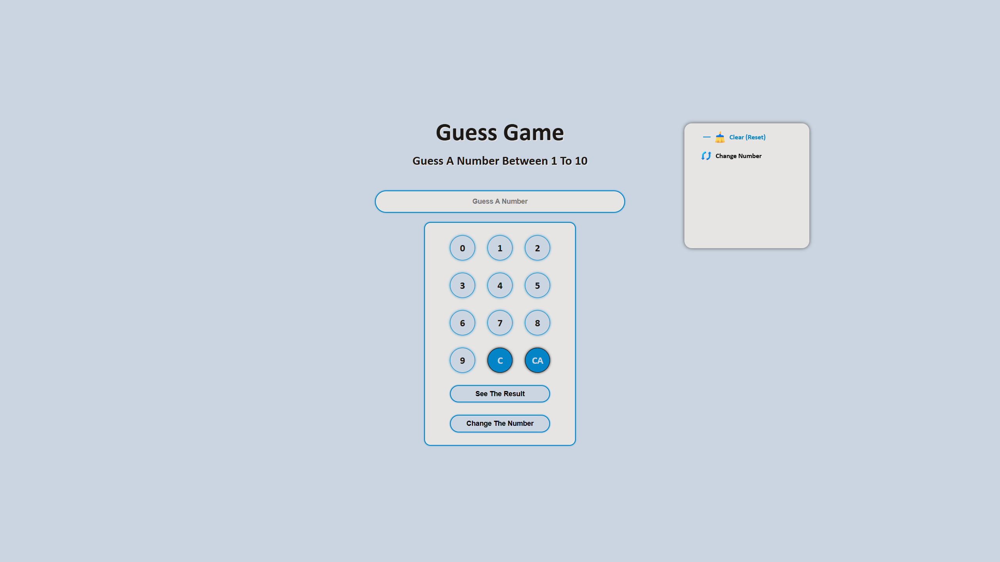

<div align="center">

# 🎯 Guess Game

### A fun and interactive number guessing game built with Vanilla JavaScript

<p>
  <a href="https://ali-boorboor.github.io/Guess-Game/"><strong>🎮 Live Demo</strong></a> •
  <a href="https://github.com/Ali-boorboor/Guess-Game"><strong>📦 Repository</strong></a>
</p>

</div>

---

## 🎲 About The Project

**Guess Game** is a responsive browser game where players try to guess a randomly generated secret number. The game provides instant feedback for each attempt, tracks the player's progress, and delivers a simple yet engaging experience using only **HTML**, **CSS**, and **JavaScript**.

This project was created to practice DOM manipulation, events, conditional logic, and interactive UI development.

---

## ✨ Features

- 🎯 Random secret number generation
- 💬 Instant feedback (Too High / Too Low / Correct)
- ❤️ Score & high score system
- 🔄 Play Again functionality
- 📱 Fully responsive design
- ⚡ Smooth and lightweight performance

---

## 🛠 Tech Stack

| Technology       | Purpose                       |
| ---------------- | ----------------------------- |
| HTML5            | Semantic structure            |
| CSS3             | Styling & responsive UI       |
| JavaScript (ES6) | Game logic & DOM manipulation |
| GitHub Pages     | Hosting                       |
| GitHub Actions   | Automatic deployment          |

---

## 📸 Preview



---

## 📂 Project Structure

```text
Guess-Game/
│
├── assets/          # Images & icons
├── css/             # Stylesheets
├── js/              # Game logic
│
├── index.html       # Main page
└── README.md
```

---

## 🚀 Getting Started

Clone the repository:

```bash
git clone https://github.com/Ali-boorboor/Guess-Game.git
```

Open the project:

```bash
cd Guess-Game
```

Run locally by opening `index.html` or using **Live Server**.

---

## 🌍 Live Demo

**Play Online**

👉 https://ali-boorboor.github.io/Guess-Game/

---

<div align="center">

Made by JavaScript and my boredom ❤️

</div>
